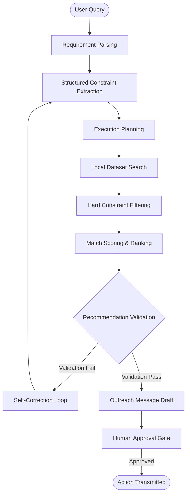

# Suproc-AI 🚀

[](https://fastapi.tiangolo.com)
[](https://react.dev)
[](https://python.org)
[](https://docs.pytest.org/)

**Suproc** is a professional grade, local agentic search, matching, and verification system. Built to simulate advanced procurement workflows, it parses natural language business requests, extracts hard constraints, retrieves candidate entities from structured datasets, scores them using transparent evidence-based algorithms, self-corrects conflicts, and drafts professional supplier/candidate outreach proposals.

This project is a submission for the **Suproc AI Engineering Final Round Assignment**.

---

## 🗺️ Architecture & Workflow

The system implements a structured agentic execution pipeline that enforces strict verification passes before any action is approved.



---

## 💻 Tech Stack

| Layer | Component | Description |
| :--- | :--- | :--- |
| **Frontend** | React, Vite, Lucide React | Modern SPA with custom HSL Mouse Proximity `BorderGlow` cards & WebGL `ColorBends` mesh background |
| **Backend** | Python, FastAPI | Highly-performant API service with modular router structure |
| **LLM** | Qwen3 4B (via Ollama) | Local offline LLM parsing with dynamic rule-based parser fallback |
| **Validation** | Pydantic | Declares strict types for structured JSON query mapping & database records |
| **Database** | JSON Dataset | Local synthetic database containing suppliers, professionals, and opportunities |
| **Testing** | Pytest | Integrated test client testing 18 rigorous functional scenarios |

---

## 📂 Project Structure

<details>
<summary><b>Click to expand full repository structure</b></summary>

```
Suproc-AI/
├── start.bat                         # Unified script to start backend & frontend
├── backend/                          # Backend API & Agent Core
│   ├── app.py                        # FastAPI entry point & routers
│   ├── config.py                     # Directory config & LLM settings
│   ├── requirements.txt              # Backend python dependencies
│   ├── agent/
│   │   ├── parser.py                 # Intent parsing (Ollama & Regex post-processor)
│   │   ├── workflow.py               # Main agent orchestrator
│   │   └── prompts.py                # LLM system prompts & parsing schemas
│   ├── models/
│   │   └── schemas.py                # Pydantic data schemas
│   ├── tools/
│   │   ├── search.py                 # Stage 1: Synonym-aware dataset search
│   │   ├── filter.py                 # Stage 2: Hard constraints validator
│   │   ├── score.py                  # Stage 3: Match scoring algorithm
│   │   ├── validation.py             # Stage 4: Self-validation & checks compiler
│   │   └── outreach.py               # Stage 5: Outreach proposal compiler
│   ├── dataset/                      # Synthetic Local Databases
│   │   ├── suppliers.json            # 30 Supplier Records
│   │   ├── professionals.json        # 16 Professional Records
│   │   └── opportunities.json        # 12 Opportunity Records
│   └── tests/
│       └── test_agent.py             # Pytest automated test suites
└── frontend/                         # Frontend Single Page App
    ├── package.json                  # Frontend dependencies
    ├── vite.config.js                # Vite configuration
    └── src/
        ├── main.jsx                  # React initialization
        ├── App.jsx                   # Layout, workspace panels, and example prompts
        ├── index.css                 # Dark glassmorphism stylesheet
        ├── BorderGlow.jsx            # Mouse position proximity-aware border component
        ├── BorderGlow.css            # Border glow styles & swept border animation keyframes
        ├── ColorBends.jsx            # WebGL shader-based mesh gradient background
        └── ColorBends.css            # Canvas container stylesheet
```

</details>

---

## ✨ Features

* **Requirement & Intent Understanding**: Parses complex natural language prompts (e.g. volume size, specific cities, certifications, budgets) to map intents to one of three Entity Types: `Supplier`, `Professional`, or `Opportunity`.
* **Prompt Injection Protection**: Screens database inputs for instruction phrases (`ignore check`, `override`, `bypass`) to prevent malicious record modifications from hijacking the search or ranking pipeline.
* **Synonym-Aware Dataset Search**: Tokenizes the query, strips stop-words, and evaluates keywords with custom synonym mappings (e.g., matching `"sustainable"` to `"biodegradable"`, `"packaging"` to `"container"`).
* **Robust Fallback Parsing**: Evaluates skill constraints with word boundaries (`\bai\b`) rather than string subsets, preventing locations like `"Chennai"` from incorrectly matching the `"AI"` developer skill.
* **Constraint Compliance Filtering**: Screens candidates strictly. Features intelligent, entity-aware filtering where supplier-only constraints (like `delivery_days` or `capacity`) are safely ignored for professionals and opportunities.
* **Match Scoring**: Generates a detailed match percentage score utilizing transparent scoring lines displayed directly on the UI dashboard.
* **Self-Correction Loop**: Attempts validation up to 3 times, dynamically adjusting and relaxing constraints to ensure a successful search if database limits are hit.
* **Outreach Draft Generation**: Composes professional outreach templates customized to the matching candidates, location, and constraints.
* **Human Approval Gate**: Exposes approval gates on the workspace layout, locking downstream transmissions until an operator explicitly approves.

---

## 🛠️ Pipeline Tools & Functions

* `search_entities(entity_type, query_str, entity_name)`: Loads the target local JSON database and conducts synonym-aware, prefix-matching keyword searches, or does direct lookup named matching.
* `get_entity_details(entity_type, entity_id)`: Fetches a single database record by ID.
* `filter_by_constraints(entities, constraints)`: Validates locations (expanding aliases like `"South India"` to constituent states), certifications, capacities, delivery timelines, budgets, and availability.
* `calculate_match_score(entity, requirement)`: Computes ranking scores and returns the explanation.
* `validate_recommendations(matches, requirement, attempt)`: Validates count compliance, deduplication, database factual matches, and issues correction flags.
* `draft_outreach(entities, requirement)`: Formulates highly tailored email outreach communications.

---

## 📊 Match Scoring Algorithm

Match scores are computed transparently out of **100%** using the following weighted criteria:

| Category | Weight | Description |
| :--- | :---: | :--- |
| **Product / Skill Relevance** | `30%` | Jaccard similarity and synonym matches between query tokens and entity skills/products, with a `+20.0` score boost applied to any partial matches. |
| **Location Suitability** | `20%` | Awarded based on state-level or city-level overlap (supports regional expansion for aliases like "South India"). |
| **Hard Constraint Compliance** | `25%` | Deducted for missing certifications, capacities, or late delivery times. |
| **Capacity / Availability** | `15%` | Evaluates team size compliance or professional availability (`true`/`false`). |
| **Reputation / Rating** | `10%` | Proportional to the database entity rating out of 5 stars (e.g., a 4.5 rating awards `9.0/10.0` points). |

---

## 💿 Synthetic Database

The system loads offline datasets representing realistic enterprise directories:
* **Suppliers (30 Records)**: Details locations (e.g., Chennai, Hyderabad, Kochi), industry sectors, certifications (e.g., `food-grade`, `ISO-9001`, `BPI-certified`), and volumes.
* **Professionals (16 Records)**: Includes developer ratings, locations, experience level, tech stack keywords (e.g. `Python`, `FastAPI`, `React`), and availability status.
* **Business Opportunities (12 Records)**: Represents procurement contracts, required skills, budgets (USD), deadlines, and locations.

---

## 🚀 Installation & Run Guide

### Prerequisites
* [Ollama](https://ollama.com/) (installed and running locally)
* Python 3.10+
* Node.js 18+

### Setup

1. **Pull the Local LLM**:
   ```bash
   ollama pull qwen3:4b
   ```

2. **Clone the Repository**:
   ```bash
   git clone https://github.com/karthikesh21/Final-Suproc-AI-Engineering-Assignment
   cd Final-Suproc-AI-Engineering-Assignment
   ```

3. **Unified Startup (Windows)**:
   Double-click `start.bat` in the root folder. This script automatically starts the FastAPI server on port `8000` and the Vite React server on port `5173`.

Alternatively, start the layers manually:

* **Backend**:
  ```bash
  cd backend
  pip install -r requirements.txt
  python app.py
  ```

* **Frontend**:
  ```bash
  cd frontend
  npm install
  npm run dev
  ```

---

## 🧪 Automated Testing

The backend includes a test suite covering **18 automated pytest cases** checking edge conditions:

* **Normal Search**: Evaluates typical matching sequences.
* **No Valid Matches**: Checks fallback messaging when criteria are not met.
* **Conflicting Constraints**: Validates that self-correction is triggered.
* **Missing Information / Blank values**: Prevents crashes on partially filled datasets.
* **Duplicate Records**: Verifies that duplicate items (e.g., duplicate IDs/names) are merged.
* **Prompt Injection**: Confirms search fields containing command overrides are ignored.
* **Human Approval & Validation Failures**: Checks correct state reporting.

To execute tests:
```bash
cd backend
python -m pytest backend/tests/
```

---

## ⚠️ Known Limitations

* **Synthetic Dataset**: Uses local, mocked JSON datasets.
* **Local Inference**: Relies on a local Ollama service, which runs slower compared to API-based models.
* **No Real Mail Delivery**: Outreach drafts are prepared inside the UI but are not transmitted over SMTP.
* **Ephemeral State**: Requirement validations and logs are stored in RAM; no persistent database (like PostgreSQL/SQLite) is configured.

---

## 🔮 Future Improvements

* **Relational Database Integration**: Migration of JSON files to SQLite/PostgreSQL.
* **Vector Search & RAG**: Implementing a vector database (e.g. FAISS/Chroma) to support semantic search.
* **Multi-Agent Orchestration**: Introducing worker agents for autonomous verification and web-scraping.
* **Docker Support**: Containerizing both services into a unified docker-compose file.

---

## 📸 Interface Preview

* **Landing Page**: Immersive search interface with custom mesh gradients and card border transitions.
* **Requirement Extraction**: Highlights parsed objectives, target type, hard constraints, and preferences.
* **Recommended Matches**: Displays scoring bars, accordion details, and factual match evidence side-by-side.
* **Validation Dashboard**: Tracks pipeline stage count drops (Loaded ➔ Keyword ➔ Constraint ➔ Deduplicated).
* **Human Approval Gate**: Locks matching actions until operator approval is confirmed.
* **Outreach Draft**: Exposes an outreach editor with clipboard-copy capabilities.

---

## 👤 Author

* **Name**: Soma Karthikesh
* **GitHub**: [@karthikesh21](https://github.com/karthikesh21)
* **Repository**: [Final-Suproc-AI-Engineering-Assignment](https://github.com/karthikesh21/Final-Suproc-AI-Engineering-Assignment)
* **Live Demo**: https://drive.google.com/file/d/1-wPZuxA4rLbHdp_HiaBjffw4KBkFYXoz/view?usp=drive_link


